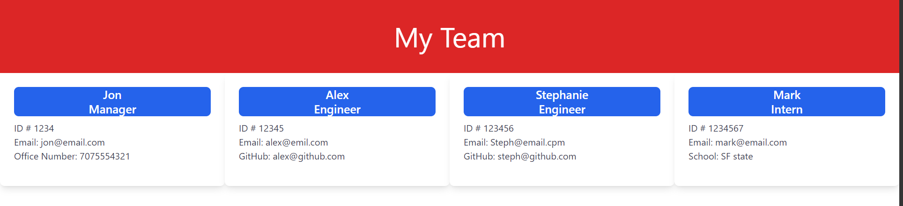
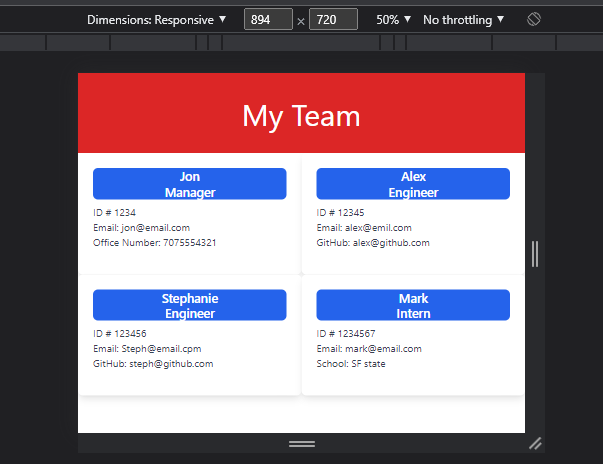
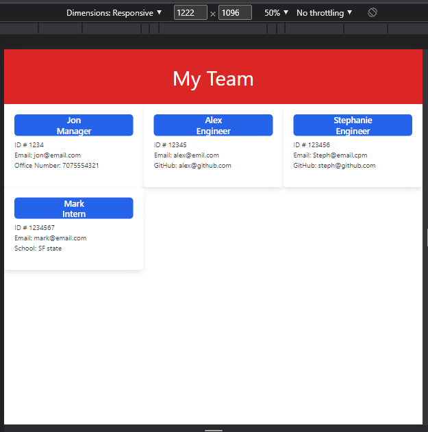
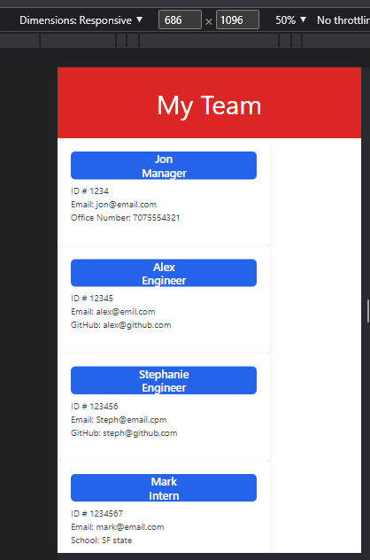
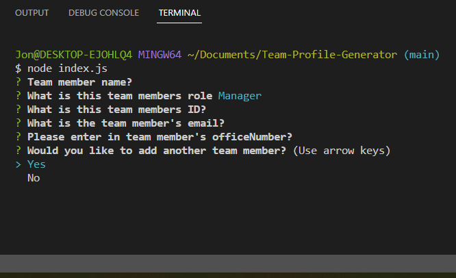
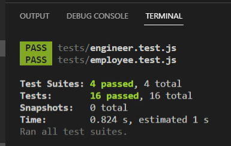

# Team-Profile-Generator
## Badges 

---

## Table of Contents
- [License](#license)
- [Description](#description)
- [Usage](#usage)
- [Installation](#installation)
- [Want to Contribute?](#want-to-contribute)
- [Testing](#testing)
- [Questions?](#questions)
- [Contact Me](#contact-me)

---

## License
[MIT](https://opensource.org/licenses/MIT)
Read more about MIT

---

## Description
The Team Profile Generator is a challenge to build a Node.js command-line application that takes in information about an engineer team and generates an HTML webpage. The webpage displays the contact information for each team member along with their role on the team. Part of the challenge was to write unit tests for each part of the code and to ensure it passes all tests.

---

## Usage
This project helps you have an organized and visual place to have your Team Member's information for quick refernceand readability.

---

## Installation
To start the Team Profile Generator in the command-line type node index.js

---

## Want to Contribute
Not taking contributions at this time.

---

## Testing
To test in the command line type npm test

---

## Application Examples

[Drive Link to video of working application](https://drive.google.com/file/d/1mvI3pQNY_Zjd5JQVu4K7VZlHrXxi4TR8/view)

---
## Questions?
### Contact Me
- https://github.com/JonCerruti
- jonathancerruti@gmail.com
